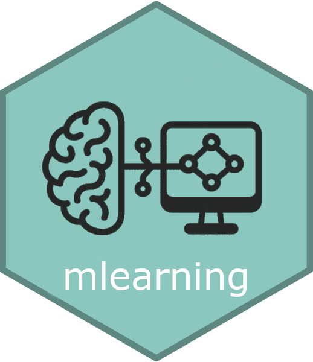

<!-- README.md is generated from README.Rmd. Please edit that file -->

# ‘SciViews::R’ - Machine Learning Algorithms with Unified Interface <a href="https://www.sciviews.org/mlearning"></a>

<!-- badges: start -->

[](https://github.com/SciViews/mlearning/actions/workflows/R-CMD-check.yaml)
[](https://app.codecov.io/gh/SciViews/mlearning)
[](https://cran.r-project.org/package=mlearning)
[](https://sciviews.r-universe.dev/mlearning)
[](https://www.gnu.org/licenses/gpl-2.0.html)
[](https://www.tidyverse.org/lifecycle/#stable)
<!-- badges: end -->

An unified interface is provided to various machine learning algorithms
like linear or quadratic discriminant analysis, k-nearest neighbor,
learning vector quantization, random forest, support vector machine, …
It allows to train, test, and apply cross-validation using similar
functions and function arguments with a minimalist and clean,
formula-based interface. Missing data are processed the same way as base
and stats R functions for all algorithms, both in training and testing.
Confusion matrices are also provided with a rich set of metrics
calculated and a few specific plots.

## Installation

You can install the released version of {mlearning} from
[CRAN](https://CRAN.R-project.org) with:

``` r
install.packages("mlearning")
```

You can also install the latest development version. Make sure you have
the {remotes} R package installed:

``` r
install.packages("remotes")
```

Use `install_github()` to install the {mlearning} package from GitHub
(source from **master** branch will be recompiled on your machine):

``` r
remotes::install_github("SciViews/mlearning")
```

R should install all required dependencies automatically, and then it
should compile and install {mlearning}.

## Further explore {mlearning}

You can get further help about this package this way: make the
{mlearning} package available in your R session:

``` r
library("mlearning")
```

Get help about this package:

``` r
library(help = "mlearning")
help("mlearning-package")
```

For further instructions, please, refer to the help pages at
<https://www.sciviews.org/mlearning/>.

## Code of Conduct

Please note that the {mlearning} package is released with a [Contributor
Code of
Conduct](https://contributor-covenant.org/version/2/1/CODE_OF_CONDUCT.html).
By contributing to this project, you agree to abide by its terms.
